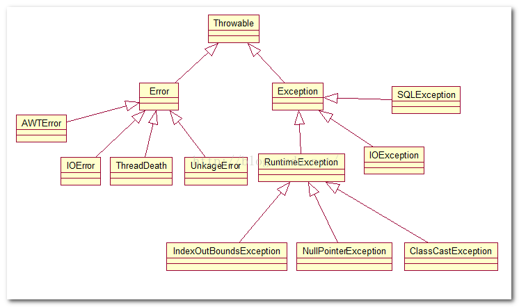

### 1. RxJava2 比RxJava 1 有什么区别，主要升级。

	1). 背压 
	
	2). 新增Flowable
	
	3). 不支持null，异常
	
	4). 新增Maybe
	 
	5). ActionN、FuncN
		
		Action0 -> Action
		Action1 -> Consumer
		Action2 ->BiConsumer
		Action3~9 不用
		ActionN Consumer<Object[]>
		
		Func  -> Function
		Func2 -> BiFunction
		Func3~9 -> Function3~9
		FuncN -> FUnction<Object[],R>
	
	6). Observable.OnSubscribe -> ObservableOnSubscribe
		使用ObservableEmitter替代Subscriber向Observer发送数据
		
	7). Observable.Transformer -> ObservableTransformer
			FlowableTransformer
			
	8). Subscription -> Disposable
	
	9). first()用法改变
	
	10). toBlocking().y -> blockingY() 
	
	11). rx.xxx -> io.reactivex.xxx   包名

### 2. 四种引用类型
>强、软、弱、虚
>
>从JDK 1.2版本开始，把对象的引用分为4种级别

### 3. Android的进程级别
>前台、可见、服务、后台、空

* 前台

    用户当前正在做的事情需要这个进程。如果满足下面的条件之一，一个进程就被认为是前台进程：

    这个进程拥有一个正在与用户交互的Activity(这个Activity的onResume()方法被调用)。

    这个进程拥有一个绑定到正在与用户交互的activity上的Service。

    这个进程拥有一个前台运行的Service（service调用了方法startForeground()）.

    这个进程拥有一个正在执行其任何一个生命周期回调方法（onCreate(),onStart(),或onDestroy()）的Service。

    这个进程拥有正在执行其onReceive()方法的BroadcastReceiver。
    
* 可见  
 
    这个进程拥有一个不在前台但仍可见的Activity(它的onPause()方法被调用)。当一个前台activity启动一个对话框时，就出了这种情况。
    
* 服务
    
    正在运行的，不在上述两种状态的service
    例如: 音乐播放，下载

* 后台

    不可见状态的activity进程，onstop被调用

   这样的进程们不会直接影响到用户体验，所以系统可以在任意时刻杀了它们从而为前台、可见、以及服务进程们提供存储空间。通常有很多后台进程在运行。它们被保存在一个LRU(最近最少使用)列表中来确保拥有最近刚被看到的activity的进程最后被杀。如果一个activity正确的实现了它的生命周期方法，并保存了它的当前状态，那么杀死它的进程将不会对用户的可视化体验造成影响。因为当用户返回到这个activity时，这个activity会恢复它所有的可见状态。 

* 空

    一个进程不拥有入何activity组件。
    
    唯一原因是做为缓存以改善组件再次于其中运行时的启动时间。经常被杀死，保持进程缓存和系统内核缓存之间的平衡。


### 4. js 如何与 native 交互

* js调用java
```
   
   // html代码
         <button onClick="window.androidShare.jsShareMethod('param')">js调java</button>
         
   //java代码
        mWebView.getSettings().setJavaScriptEnabled(true);
        mWebView.addJavascriptInterface(new WebInterface(), "androidShare");
        
         private class WebInterface {
                @JavascriptInterface
                public void jsShareMethod(String result) {
                }
            }
            
```
* java调用js

实现Android调用JS脚本是非常简单的，直接Webview调用loadUrl方法，里面是JS的方法名，并可以传入参数，javascript：xxx()方法名需要和JS方法名相同

```
    //java代码
    contentWebView.loadUrl("javascript:javacalljs()");
    
    //html代码
    <script>
        function javacalljs(){
        alert("js")
    </script>
    
```
### 5. glide(fresco/Picasso)加载图片遇到的坑(大图片)，对比


  * glide默认使用RGB_565，没有缓存透明度
  * Picasso缓存的是全尺寸的，而Glide缓存的是跟ImageView尺寸相同的。


### 6. Mediaplayer生命周期、bilibili


### 7. recyclerview添加headerview、footview
> 通过itemype

### 8. 抽象类，设计模式中用到抽象类的都有哪几种
>抽象类可以有构造函数，但是不能实例化
>
>模板模式、抽象工厂、装饰、策略等

### 9. java中异常分几种，举例

* Checked Exception

                除了特殊子类RuntimeException体系的，只要是Exception和其子类都是。这种问题一旦出现，希望在编译时就进行检测，让这种问题有对应的处理方式
                IOException
* runtime exception
    
                这种问题的发生，让功能无法继续，运算也无法进行，更多是因为调用的原因导致的。或者引发程序内部状态改变，导致异 常。这种问题一般不处理，直接编译通过，在运行时，调用者调用时引发异常从而程序强制停止，此时调用者即可对异常进行修正。
                NullpointerException，IndexOfBoundsExcetion



### 10. Handler机制

同一个线程下的handler共享一个looper对象，消息中保留了对handler的引用，只要有消息在队列中，那么handler便无法被回收，如果handler不是static，那么使用Handler的Service和Activity就也无法被回收，即便它们的ondestroy方法被调用。这就可能导致内存泄露。当然这通常不会发生，除非你发送了一个延时很长的消息。

 [handler](../app/src/main/java/com/gin/interview/handler/handler笔记.md)
 
### 11.  HandlerThread
>内部加入Looper的Thread

```
    HandlerThread mThread = new HandlerThread("hanlder");
    //启动
    mThread.start();
    
    
    //释放资源
    mThread.quit() ;
    
```

### 12. AsyncTask实现的原理
[AsyncTask](../app/src/main/java/com/gin/interview/handler/AsyncTask.md)


### 13.  rxJava(三个网络请求怎么处理)
 
 * merge/zip
 
 ```
 	Observable ob1 = Observer.from(1);
 	Observable ob2 = Observer.from(2);
 	
 	Observable.merge(ob1,ob2)
 				.subscribe( new Observer(){
 				//onNext
 				
 				//onError()
 				
 				//onCompleted()
 				}
 				);
 ```
 
 * join/combineLatest
 * and/then/when 
 
### 14. 方法加final

不能被子类重写，不能使abstract

### 15. java中新的集合

Apache common.collections中新增了几个集合类

* BidiMap

双向的，通过key/value互查

* MultiMap

一个key指向一组对象，add()，remove()相同，get()时，返回Collection
实现一对多

* LazyMap

key/value不存在，调用的时候创建，一般需要使用LazyMap.decorate(Map,Factory)的方式来创建

### 16. MVC在Android中引用

### 17. targetSDKVersion、minSDKVersion

* build target

ec里面project.properties文件里target=android-18，使用sdk中platforms目录下Android-18目录中的android.jar
as中设置compileSdkVer

* minSDKVersion

默认1，乡下尖肉的最小版本，如果目标手机的api 小于这个值，系统会阻止安装并报错  INSTALL_FAILED_OLDER_SDK

* targetSDKVersion

目标API Level，不设置，默认跟min相同，在运行应时起作用，检测是不是要以兼用模式运行

* maxSdkVersion

2.0前程序安装时、系统升级后起作用
官方不推荐使用

### 18. 数据库升级，增加字段
