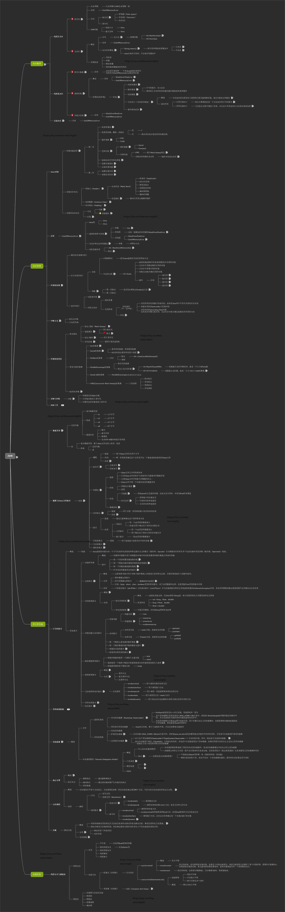

* [leetcode](com/gin/leetcode/)
* [锁](com/gin/lock/锁.md)
* [设计模式](com/gin/pattern/设计模式.md)
* [引用类型](com/gin/other/引用.md)
* [其他总结](com/gin/other/README.md)
* [排序](com/gin/sort/)
* [SVN](com/gin/svn/svn.md)
* [线程](com/gin/thread/Thread.md)
* jvm
 