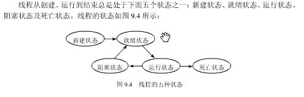

### 线程池
>原理:创建固定大小的线程池。每次提交一个任务就创建一个线程，直到线程达到线程池的最大大小。
>线程池的大小一旦达到最大值就会保持不变，如果某个线程因为执行异常而结束，那么线程池会补充一个新线程。
>如果线程池的大小超过了处理任务所需要的线程，那么就会回收部分空闲（60秒不执行任务）的线程，
>当任务数增加时，此线程池又可以智能的添加新线程来处理任务。此线程池不会对线程池大小做限制，
>线程池大小完全依赖于操作系统（或者说JVM）能够创建的最大线程大小。SynchronousQueue是一个是缓冲区为1的阻塞队列。

1. 线程的生命周期状态都有什么？

